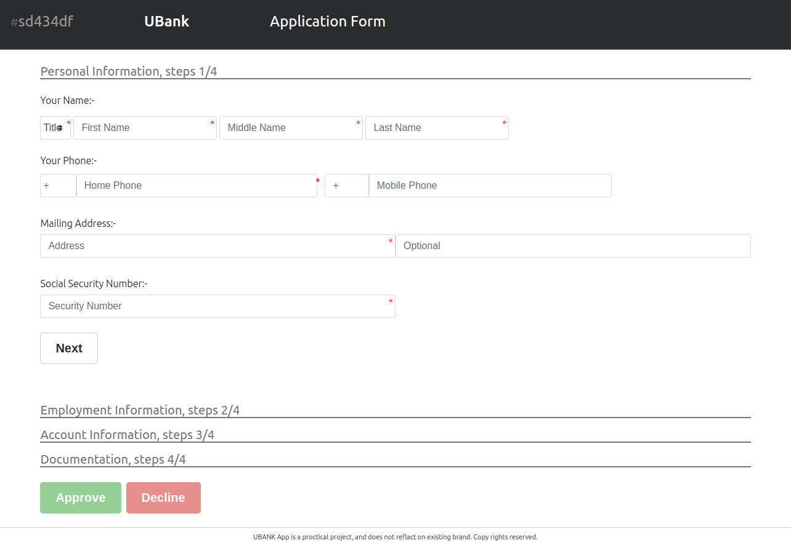
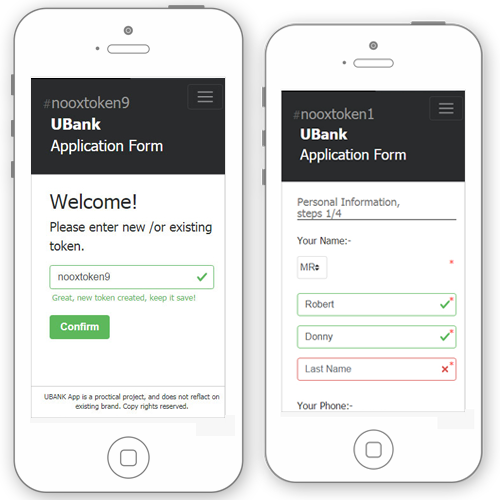

#### - [ Developed by Eaglex ](http://eaglex.net)

#### - Bank Application -

Practical bank application project for superficial brand name UBANK. A fully responsive cross browser application using Angular 1.6 MVC framework with OOP/Typescript and RESTFul API/ and data retrieval. Backend mongodb/mongoose ORM with CRUD. Multer for uploading and storing files for retrieval.
You can register as new user, and return later to complete the application..

##

- A fully automated Gulp task runner with browsersync proxy to nodemon.
- Access to Bootstrap sass configuration using global.vars with the help of 'Wiredeb' package.
- All files are rendered using view HTML engine.
- Fully documented.
- JSHINT, TSLINT

<br/>

#### Depreciation notice and updates

This project is no longer maintained _(because Im busy building new exciting things!)._ If you find something is not working, please check release date of the project, and adjust to corresponding Node.js (even) version, then it should work.

If you are interested in my work and have questions about this project, **please drop me a comment, or email me, thanks!**

**Updates**

_Project demo is now available on github pages:_
**[ >> bank-application <<](https://eag1ex.github.io/bank-application/)**

- some variables have been hardcoded to use remote server api with free mongodb tier

<br/>



<br/>
<br/>

###### Installation

- You need to **install mongoDB** before running this application. Instructions to install on your OS here:
  https://docs.mongodb.com/manual/installation/
  make sure you assign mongod to global path, or run it from the /bin folder, and assign new database path.
- If you have problems with Sass run **$/ npm run fix** to rebuild
- **npm install will** will install all node_modules and bower_components.

```sh
$/ npm install
```

---

###### Start the App

- Once you run it and have installed, configured your mongodb, it will automatically run the process for you,
  proxyfy and start the nodemon server, and launch Chrome as default browser.
- Generated files are stored in the ./public dir along with bower_components.
- The npm task runner/gulp uses Wiredeb to dynamically inject files generated in ./public/index.html
- The server/backed is in ./server dir, some of the configuration is shared from the main
  ./config.js file, such as port.

```sh
# in this order.
### you need to change mongo configuration
$/ mongod #or mongod --dbpath /to/data
$/ npm start
```

##### Optional

- You can populate DB with dummy data from provided json ./server/config/initial_data.json
  just run **http://localhost:8080/api/createnew**
  and use the 'token' as your application number.

---

##### Stack/Setup

- Angular 1.6/component, BootStrap alpha.6/Flexbox, Sass, Typescript, nodejs/Express, Lodash, MongoDB/mongoose
  Multer, npm/gulp, nodemon/ browserSync as proxy, dynamic injection and sass globals configuration with Wiredeb.
  tslint/jshint, server RESTful API, data retrieval
- Following John Papa Angular Style Guide
- Integrated in modular fashion
- Coded in OOP

---

##### File structure

```js
/**
 *  The data flow of this app is:
 *  Layout  <<< GLOBALS
 *     > page component  <<< $dataservice
 */
```

---

##### -- Remarks --

- Tested and works without bugs on lates Chrome and Firefox, not tested on IE(SORRY!).
- All files are well documented.
- you can preview a working app video via this link **https://eaglex.net/app/work/ubank-application-angular-1-6-mongobd**
- If your server crashed and you get this error in the CLI **Error: listen EADDRINUSE :::8018**
  you will have to change the port in the ./config.js file

- if error installing node-sass> upgrade dependencies with "npm-check-updates -u& npm install"

---

###### TODOS ?

- No persistent cache included as yet, only DATA retrieval.
- User authentication not yet integrated.

---

##### Thank you


### Logs
- migrated cyclic.sh (EOL) to another koyeb.app

